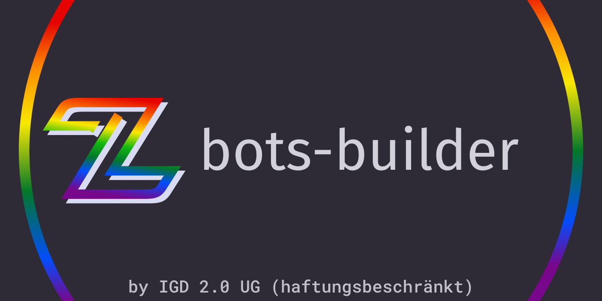

# zwoo-hq/bots-builder

Packages related for building zwoo bots.

- `@zwoo/bots-builder` - A framework and cli tool for building zwoo bots.
- `@zwoo/create-bot` - A cli tool for creating a new zwoo bot.

@zwoo/bots-builder is a set of tools for building zwoo bots. It includes a framework for developing bots and a cli tool for building (transpiling) and validating bots.

@zwoo/create-bot is a cli tool for scaffolding a new zwoo bot project. It creates a new bot project with the necessary files and dependencies.

## Getting started

You can create a new bot using the `@zwoo/create-bot` cli tool.

```bash
npx @zwoo/create-bot
yarn dlx @zwoo/create-bot
pnpm dlx @zwoo/create-bot
```

After this, you can switch into the newly created bot project and start building your bot.

```bash
cd <my-bot>
```

You can build your bot using the `zwoo-bots-builder` cli tool.

```bash
npm run build 
yarn build 
pnpm build 
```

or validate your bot. This checks, that the produced module is valid an able to run in the zwoo environment.

```bash
npm run validate
yarn validate
pnpm validate
```

Alternatively, you can use the `npx`|`yarn dlx`|`pnpm dlx` command to use a global installation of the cli tool.

```bash
npx @zwoo/bots-builder build src/main.ts
```

> [!WARNING]
> Using the global CLI might not be version compatible.

## Development

At the core, your bot is a javascript class that implements the `Bot` class from the `@zwoo/bots-builder` package. The abstract class `Bot` serves two purposes:

1. It defines the interface for the custom bot to implement.
2. It provides a set of utility functions to interact with the zwoo server.

```typescript
import { Bot } from "@zwoo/bots-builder";

export class MyBot extends Bot {

public constructor() {
    super();
  }

  public AggregateNotification(message: IncomingMessage) { }

  public Reset() { }
}

export default MyBot;
```

Every bot must implement the `AggregateNotification` and `Reset` methods. 

The `AggregateNotification` method is called whenever a new message is received by the bot. zwoo uses a custom protocol for in game communication called ZRP (zwoo request protocol). The `IncomingMessage` object is a parsed version of the ZRP message. If you want to dive deeper into the ZRP protocol, you can find the specification in the [zwoo api documentation](https://zwoo.igd20.de/docs/api/). Since the bot class provides abstraction on top of ZRP, a deep understanding of the protocol is not necessary for most bots.

The `Reset` method is called when the bot state should reset. It is usually called after a game finished and a new game is about to start.

Another crucial part of the development of zwoo bots is the `JsCard` class. The `JsCard` class is a abstraction on top of the different ways to represent cards in zwoo. It combines all in a single class, provides utility functions and allows a consistent way to interact with cards.

```typescript
// you can create a new card like this
const card = new JsCard(CardColor.Red, CardType.Skip);
// or using one of the overloads, for example:
const card = new JsCard(data.PileTop) // data: StateUpdateNotification
```

Its recommend to use the `JsCard` class for all interactions with cards from javascript. For more information or usage examples, see [`./packages/builder/src/builtin/basicStateManager.ts`](./packages/builder/src/builtin/basicStateManager.ts) 

Using `JsCard` you can also compare cards. The method also accepts all types of card representations and implicitly converts them to `JsCard` objects.

```typescript
card.equals(new JsCard(...))
card.equals(data.PileTop)
```
## Provided utilities

The `Bot` class provides a set of utility functions to interact with zwoo, the game and exposed APIs:

#### `placeCard(card: JsCard): void;`

The `placeCard` method is used to place a card on the pile. The `card` parameter is a `JsCard` object that represents the card to be placed on the pile.

#### `drawCard(): void;`

The `drawCard` method is used to draw a card from the deck.

<!-- #### `endTurn(): void;`

The `endTurn` method is used to end the current turn.  -->

#### `sendChatMessage(message: string): void;`

The `sendChatMessage` method is used to send a chat message to the game chat. The `message` parameter is the message to be sent.

#### `makeDecision(type: number, decision: number): void;`

See [ZRP#316](https://zwoo.igd20.de/docs/api/zrp.html#_316-get-player-decision-notification-server) and [ZRP#317](https://zwoo.igd20.de/docs/api/zrp.html#_317-player-decision-event-player)

`makeDecision` send a decision to the server. A decision is something like a color selection after a wild card was placed.

The decision type is given by `GetPlayerDecisionNotification.Type`. The decision is the index of the decision chosen in the `GetPlayerDecisionNotification.Options` array.

#### `requestSettings(): void;`
#### `requestDeck(): void;`
#### `requestPlayers(): void;`
and
#### `requestPile(): void;`

are used to request the current game state from the server.

> [!NOTE]
> Since the ZRP is a async protocol, the response to these requests will be handled by the `AggregateNotification` method.

> [!TIP]
> All game state except `requestSettings` can be calculated by aggregating all incoming state updates.

#### `random: Random;`

The `random` property is a random number generator exposed from the c# host. For full documentation of the `Random` class, see the [C# documentation](https://learn.microsoft.com/en-us/dotnet/api/system.random?view=net-8.0).

#### `helper: Helper`

The `helper` property is a collection of utilities exposed from the c# host.

```typescript	
interface Helper {
  toInt(obj: any): number;
}
```

> [!NOTE]
> `toInt` makes a c# cast on the argument to `int`. This is primarily used for casting enums to integers and wont work for all types (eq. strings).

#### `logger: Logger;`

The `logger` property is a logger instance exposed from the c# host, that can be used to log messages to the zwoo server. The logger provides the following methods:

```typescript	
interface Logger {
  Debug(msg: string): void;
  Info(msg: string): void;
  Warn(msg: string): void;
  Error(msg: string): void;
}
```

#### `triggerEvent(code: number, payload: any): void;`

`triggerEvent` is used to send events to the zwoo server. The `code` parameter is the corresponding ZRP Code for the event. The `payload` parameter is the data that should be sent with the event. The payload must be constructed from a provided Model. 

> [!TIP]
> Calling `triggerEvent` is only recommended for advanced use cases. The utilities provided by the `Bot` class are sufficient for most bots. For the correct usage of ZRPCodes and Models, see the [ZRP documentation](https://zwoo.igd20.de/docs/api/zrp.html)


---

License: [MIT](./LICENSE)

Copyright © 2024-present Fabian Kachlock

---

ZWOO ist eine Marke der IGD 2.0 UG (haftungsbeschränkt)

Impressum/Imprint: https://zwoo.igd20.de/imprint